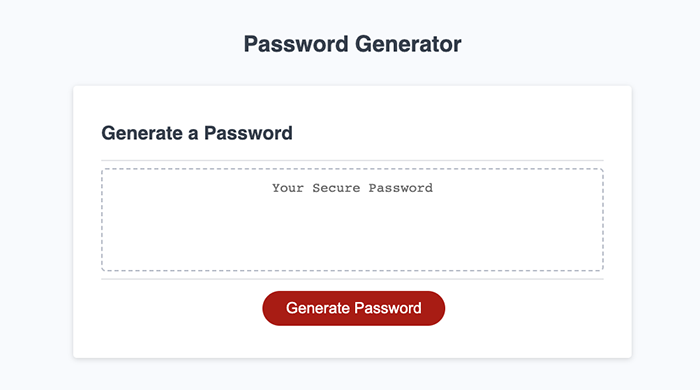
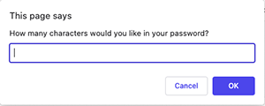
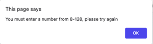
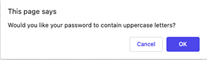
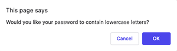
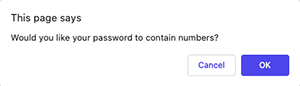
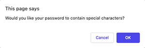
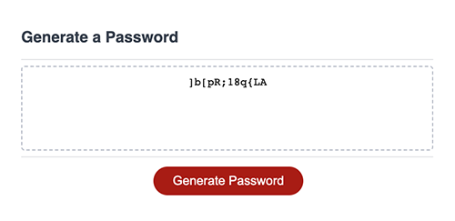

# random-password-generator

## Table of Contents
- [Description](#Description)
- [Usage](#Usage)
- [Visuals](#Visuals)

## Description
- [Click here to access my random password generator](https://mariahmcdaniel.github.io/random-password-generator/)

For this project, my goal was to write a function that generates a random password according to user-specified parameters. The options are as follows:

-Password length (with a minimum of 8 characters and a maximum of 128)

-Inclusion of uppercase letters

-Inclusion of lowercase letters

-Inclusion of numbers

-Inclusion of special characters

## Usage

When you navigate to my [password generator website](https://mariahmcdaniel.github.io/random-password-generator/), you must first click the red 'Generate Password' button. You will then see a prompt dialog in which you may enter the number of characters you would like your password to contain. Please note that **only numerals** are accepted and this number must be no less than 8 and no more than 128. If anything outside of these specifications is entered, you will receive an alert message instructing you to try again. After your desired password length has been entered, you will be asked a series of questions, via confirmation dialog boxes, regarding which types of characters you would like your password to contain. After reading each question, press 'OK' for yes or 'Cancel' for no until all of the confirmation requests have been completed. Once this is done, your randomly generated password will appear in the box on the main page.

## Visuals

- Starting page:

- Specify your password length:

- Error message:

- Choose what types of characters you would like your password to contain:

 

  

- Example of final output with a randomly generated password:

